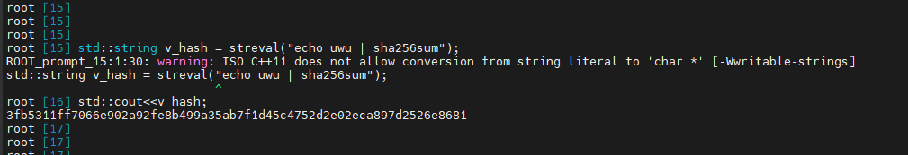

# streval.h
I tried to recreate streval() from Ch shell ( https://www.softintegration.com/docs/ch/shell/ ), because system() does not return the string. 
But this has its differences from Ch's version. 
Mainly, the shell does not retain variables, so if you do something like streval("_var=\\"hello\\"") and then try to read it with streval("echo $_var"), you won't get anything.

## How to use
You need to include <stdlib.h> and <stdio.h> and "streval.h" of course. 
Remember that if you want to see the output of something you need to use printf() (or cout if you wanna use C++) 
In this example i used CERN's Root to have the most "Ch-like" experence. You can also use Cling, or just plain old compiled C/C++. 
In this example i also used std::string because it's quicker, but the function actually returns a C string.

## Return
This function returns a char* and takes a char* as input: 
char* streval(char* in)

## Suggestions
If you want to work with variables, do not use "echo" but "printf", otherwise it will add a new line.
